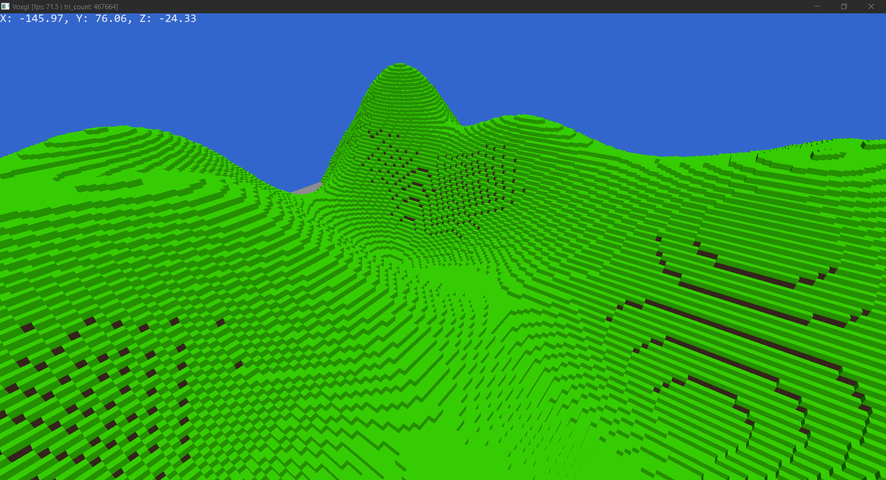

# voxgl-rs

### A voxel-based game engine

### Current features

- [Wgpu](https://wgpu.rs/) as graphics library (**OpenGL backend**)
- Infinite world generation
- Spectator-like player camera
- Basic terrain for now

Mostly inspired by [**TanTanDev's voxel engine project**](https://github.com/TanTanDev/first_voxel_engine) and using their **hashmap-based** world generation.

## Controls

- **WASD** for normal movement
- **Space/LShift** for vertical movement
- **Esc** to toggle the cursor